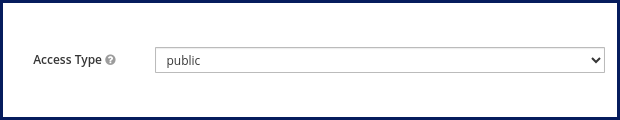
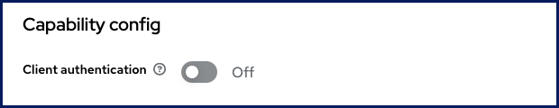

# Jitsi Keycloak Adapter

Allow `Jitsi` to use `Keycloak` as an identity and `OIDC` provider.

- [1. Features](#1-features)
- [2. Setup](#2-setup)
- [3. Keycloak configuration](#3-keycloak-configuration)
- [4. Similar projects](#4-similar-projects)
- [5. Sponsors](#5-sponsors)

## 1. Features

- SSO support for `Jitsi` via `OIDC`
- Supports config params in URL (_such as_ `#config.prejoinConfig.enabled=true`)
- Allows `guest` user and `wait for host` screen if needed
- Not based on `the external JWT` which will be deprecated in the near future.
- Not based on `tokenAuthUrl`

Check [flows](./docs/flows.txt) if you are interested in how it works.

## 2. Setup

Check [standalone setup](./docs/setup-standalone.md) guide to install it on a
standalone `Jitsi` server.

Check [Docker setup](./docs/setup-docker.md) guide to integrate it with a
Dockerized `Jitsi` setup.

## 3. Keycloak configuration

Create the client inside the realm.

- Set `client id`
- Add `Jitsi` URL into `Valid redirect URIs`
- Add `Jitsi` URL into `Web origins`
- Set `Access type`
  - For Keycloak versions `< 20.x`, set `Access type` to `public`:

    

  - For Keycloak versions `>= 20.x`, disable `Client authentication`.

    

## 4. Similar projects

- [jitsi-keycloak](https://github.com/D3473R/jitsi-keycloak)
- [Jitsi-SAML2JWT](https://github.com/Renater/Jitsi-SAML2JWT)

## 5. Sponsors

