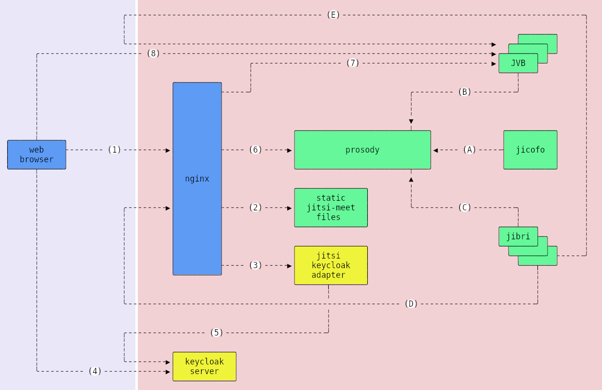

# Data



### Data on Nodes

#### Web client

The web client can get the participant list and audio/video data of the meeting
shared by all participants during the session. The client can record the session
if the local recording is allowed or by using third-party tools.

The session data are ephemeral and doesn't keep on the client-side by Jitsi web
application.

Data on the Web browser:

- No cookies
- No session data
- Some selected features keep on the local storage to be used for the next
  sessions. e.g.
  - prefered language
  - selected microphone
  - selected camera
- The browser can access the `token` generated for this client, the short-term
  authorization code, the room name, etc. during the session as ephemeral data.

#### Nginx

There is no ephemeral or persistent data of clients on `Nginx`. The IP address
of the client is clear for `Nginx` since it is needed for a working web server.

#### Jitsi-meet

There is no ephemeral or persistent data of clients on `jitsi-meet`.

#### Jitsi-keycloak-adapter

There is no persistent data of clients on `jitsi-keycloak-adapter`.

Service related data:

- Keycloak URL\
  _set as environment variable when creating the container_\
  _e.g. `https://ucs-sso-ng.mydomain.corp`_
- Keycloak Realm\
  _set as environment variable when creating the container_\
  _e.g. `ucs`_
- Keycloak Client ID\
  _set as environment variable when creating the container_\
  _e.g. `jitsi`_
- JWT application ID\
  _set as environment variable when creating the container_
- JWT secret\
  _set as environment variable when creating the container_

Ephemeral client data:

- The meeting room name
- The short-term authorization code\
  _e.g. `bac2e678-94e6-4fc3-a0fd-...-33d8-4737-9628-5dcf62852656`_
- The user info comes from Keycloak as a response
  ```json
  {
    sub: "f:d704f61d-fade-4641-b03a-1f211206c5b6:emrah",
    email_verified: true,
    name: "emrah",
    preferred_username: "emrah",
    email: "emrah@mydomain.corp"
  }
  ```

#### Keycloak

Out of our scope.

#### Prosody

There is no persistent data of clients on `Prosody`.

Service related data:

- The password of `jicofo`\
  _set as environment variable when creating the container_
- The password of `JVB`\
  _set as environment variable when creating the container_
- The password of `jibri`\
  _set as environment variable when creating the container_
- The password of `TURNS`\
  _set as environment variable when creating the container_
- JWT application ID\
  _set as environment variable when creating the container_
- JWT secret\
  _set as environment variable when creating the container_

Ephemeral client data:

- The meeting room name
- Randomly generated session ID of the client\
  _e.g. `d7029d1a-de92-463b-bb6a-8d267bc29b67@jitsi.mydomain.corp`_
- The content of the token generated for the client
  ```json
  {
    "aud": "myappid",
    "iss": "myappid",
    "sub": "*",
    "room": "myroom",
    "iat": 1700738233,
    "nbf": 1700738040,
    "exp": 1700752440,
    "context": {
      "user": {
        "id": "bac2e678-94e6-4fc3-a0fd-...-33d8-4737-9628-5dcf62852656",
        "name": "emrah",
        "email": "emrah@mydomain.corp",
        "lobby_bypass": true
      }
    }
  }
  ```

#### Jicofo

There is no persistent data of clients on `Jicofo`.

Service related data:

- The password of the service\
  _set as environment variable when creating the container_

Ephemeral client data:

- The meeting room name
- Randomly generated session ID of the client\
  _e.g. `d7029d1a-de92-463b-bb6a-8d267bc29b67@jitsi.mydomain.corp`_

#### JVB

There is no persistent data of clients on `JVB`. The IP address of the client is
clear for `JVB` since it is needed for a working system _(8)_.

Service related data:

- The password of the service\
  _set as environment variable when creating the container_

Ephemeral client data:

- The meeting room name
- Randomly generated session ID of the client\
  _e.g. `d7029d1a-de92-463b-bb6a-8d267bc29b67@jitsi.mydomain.corp`_
- The IP address of the client

#### Jibri

There is no persistent data of clients on `Jibri`.

Service related data:

- The passwords of the service\
  _set as environment variables when creating the container_

Since the headless `Chrome` of `Jibri` works like a Jitsi web client, it can
access the data of the meeting session such as participant list, audio/video,
etc.

### Data on Pipelines

#### (1) Web browser - Nginx

_encrypted data, `HTTPS`_

See proxied pipelines for the actual data.

#### (2) Nginx - Jitsi-meet

There is no client data on this pipeline.

#### (3) Nginx - Jitsi-keycloak-adapter

_unencrypted data, `HTTP`_

- The short-term authorization code (_input_)\
  _e.g. `bac2e678-94e6-4fc3-a0fd-...-33d8-4737-9628-5dcf62852656`_
- The token generated for the client (_output_). e.g.
  ```json
  {
    "aud": "myappid",
    "iss": "myappid",
    "sub": "*",
    "room": "myroom",
    "iat": 1700738233,
    "nbf": 1700738040,
    "exp": 1700752440,
    "context": {
      "user": {
        "id": "bac2e678-94e6-4fc3-a0fd-...-33d8-4737-9628-5dcf62852656",
        "name": "emrah",
        "email": "emrah@mydomain.corp",
        "lobby_bypass": true
      }
    }
  }
  ```

#### (4) Web browser - Keycloak

Out of our scope

#### (5) Jitsi-keycloak-adapter - Keycloak

_encrypted data, `HTTPS`_

- The short-term authorization code (_output_)\
  _e.g. `bac2e678-94e6-4fc3-a0fd-...-33d8-4737-9628-5dcf62852656`_
- The user info comes from Keycloak as a response (_input_)
  ```json
  {
    sub: "f:d704f61d-fade-4641-b03a-1f211206c5b6:emrah",
    email_verified: true,
    name: "emrah",
    preferred_username: "emrah",
    email: "emrah@mydomain.corp"
  }
  ```

#### (6) Nginx - Prosody

_unencrypted data, web-based `XMPP` with `HTTP`_

`XML` messages

#### (7) Nginx - JVB

_unecrypted data, `HTTP`_

Signaling messages

#### (8) Web client - JVB

_encrypted data, `DTLS-SRTP`_

audio and video streams

#### (A) Jicofo - Prosody

_encrypted data, `XMPP` with `TLS`_

`XML` messages

#### (B) JVB - Prosody

_encrypted data, `XMPP` with `TLS`_

`XML` messages

#### (C) Jibri - Prosody

_encrypted data, `XMPP` with `TLS`_

`XML` messages

#### (D) Jibri - Nginx

_encrypted data, `HTTPS`_

Works like `(1)`.

#### (E) Jibri - JVB

_encrypted data, `DTLS-SRTP`_

Works like `(8)`.
